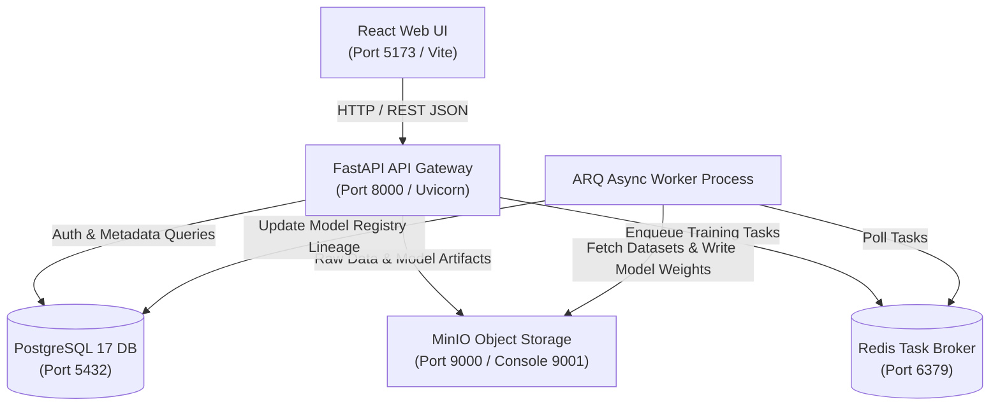
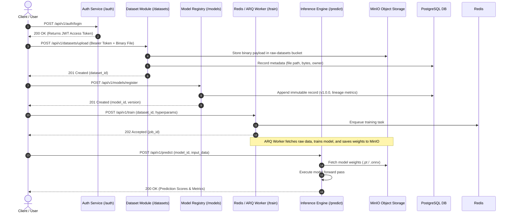

ผมไม่พุตของพวกไฟล์ของพวก agent มานะครับในส่วน agent_folder กับไฟล์ .md บางไฟล์

# 🚀 FastAPI AI Ecosystem Backend Workspaces


An end-to-end modern AI platform combining a high-performance FastAPI backend microservice architecture with a modern React (Vite) frontend web application. The platform provides secure user authentication, object storage integration with MinIO, dataset metadata management with PostgreSQL 17, an append-only machine learning model registry, asynchronous automated training pipelines backed by Redis and ARQ, and structured JSON system logging.

---

## 1. Quick Start & Setup Guide

### Prerequisites
Before running the application, ensure the following software tools are installed on your environment:
- **Python 3.8+** (Python 3.10+ recommended)
- **Node.js 18+** & `npm`
- **Docker & Docker Compose** (for running backing services: PostgreSQL 17, Redis, MinIO, Label Studio)

### Step 1: Environment Setup
Copy the environment template file to create your active `.env` configuration file:
```bash
cp .env.sample .env
```
Review `.env` if you need to adjust database passwords, secret keys, or host ports.

### Step 2: Start Backing Services
Launch PostgreSQL 17, Redis, MinIO Object Storage, and Label Studio in background mode:
```bash
docker-compose up -d
```
Or using the Docker CLI V2 command:
```bash
docker compose up -d
```

### Step 3: Run FastAPI Backend Server
Execute the launcher script `run.sh`, which automatically detects virtual environments and starts the Uvicorn server:
```bash
./run.sh
```
To run the FastAPI backend server on a custom port (for example, port `8000`):
```bash
PORT=8000 ./run.sh
```

### Step 4: Run React Frontend Application
In a separate terminal, navigate to the `frontend` directory, install all Node dependencies, and start the Vite development server:
```bash
cd frontend
npm install
npm run dev
```

### System Access Endpoints & Web Interfaces

| Application / Service | Endpoint URL | Description & Credentials |
| :--- | :--- | :--- |
| **React Frontend UI** | [http://localhost:5173](http://localhost:5173) | User Registration, OAuth Login, and Protected Token Dashboard |
| **FastAPI Swagger OpenAPI Docs** | [http://localhost:8000/docs](http://localhost:8000/docs) | Interactive API Exploration and Endpoint Testing |
| **MinIO Console Interface** | [http://localhost:9001](http://localhost:9001) | User: `minioadmin` \| Password: `minioadmin` |
| **Label Studio Platform** | [http://localhost:8080](http://localhost:8080) | Data Annotation and Labeling Platform |

---

## 📌 API Specification Table

| โดเมนงาน (Domain) | HTTP Verb | API Endpoint | หน้าที่และการทำงาน (Functionality) |
| :--- | :---: | :--- | :--- |
| **1. Authentication** | `POST` | `/api/v1/auth/register` | สมัครสมาชิกใหม่ เข้ารหัส Password ด้วย Bcrypt |
| | `POST` | `/api/v1/auth/login` | ตรวจสอบรหัสผ่าน ออก Stateless JWT Access Token |
| | `GET` | `/api/v1/auth/me` | ดึงข้อมูลโปรไฟล์ผู้ใช้งานปัจจุบันที่ยืนยันตัวตนแล้ว |
| **2. Dataset Storage** | `POST` | `/api/v1/datasets/upload` | สตรีมไฟล์ดิบไป MinIO (`raw-datasets`) และบันทึก Metadata ลง PostgreSQL |
| | `GET` | `/api/v1/datasets` | ดูรายการชุดข้อมูลทั้งหมด รองรับ Pagination (`skip/limit`) |
| | `GET` | `/api/v1/datasets/{dataset_id}` | ดึงรายละเอียดชุดข้อมูลรายตัวตาม ID |
| **3. Model Registry** | `POST` | `/api/v1/models/upload` | อัปโหลดและลงทะเบียนโมเดลเวอร์ชันใหม่แบบ Append-Only Log |
| | `GET` | `/api/v1/models` | ดูประวัติประวัติเวอร์ชันโมเดลทั้งหมดในระบบ (Audit Trail) |
| | `GET` | `/api/v1/models/latest` | ดึงไฟล์โมเดลเวอร์ชันล่าสุดที่เสถียรสำหรับนำไปทำนายผล |
| | `GET` | `/api/v1/models/{model_id}` | ดึงรายละเอียดโมเดลตาม ID |
| **4. Async Training** | `POST` | `/api/v1/training/start` | สั่งเริ่มฝึกโมเดล คืนค่า **`202 Accepted`** + `job_id` โยนงานเข้า Redis Queue |
| | `GET` | `/api/v1/training/status/{job_id}` | ตรวจสอบสถานะและความคืบหน้าการฝึกโมเดล (Polling) |
| | `POST` | `/api/v1/training/cancel/{job_id}` | ยกเลิกงานฝึกโมเดลในคิว |
| **5. Inference & Monitoring** | `POST` | `/api/v1/predict` | ส่งข้อมูลเข้าประมวลผลทำนายผลความเร็วสูง (Low-latency Inference) |
| | `GET` | `/api/v1/system/health` | ตรวจเช็คสุขภาพการเชื่อมต่อ PING ไปยัง PostgreSQL, MinIO, Redis, Label Studio |
| | `GET` | `/api/v1/system/logs` | เรียกดูประวัติ Log การทำงานรูปแบบ Structured JSON |

---

## 2. System Architecture & Component Diagrams

### 2.1 High-Level Architecture Diagram

The system follows a clean microservices architecture decoupling the React web interface, FastAPI gateway router, database persistence, object storage, and background processing workers.

#### Mermaid Diagram


#### ASCII Block Diagram
```text
+-------------------------------------------------------------------+
|                        React Web Frontend                         |
|                   (Vite Server - Port 5173)                       |
+-------------------------------------------------------------------+
                                  |
                                  | HTTP / REST API Requests
                                  v
+-------------------------------------------------------------------+
|                       FastAPI API Gateway                         |
|                   (Uvicorn - Port 8000)                           |
+-------------------------------------------------------------------+
         |                        |                        |
         | SQL Metadata           | S3 Protocol            | Enqueue Jobs
         v                        v                        v
+------------------+     +------------------+     +------------------+
|  PostgreSQL 17   |     |  MinIO Storage   |     |   Redis Queue    |
| (Database: 5432) |     |  (Bucket: 9000)  |     |  (Broker: 6379)  |
+------------------+     +------------------+     +------------------+
                                                           |
                                                           | Task Consumption
                                                           v
                                                  +------------------+
                                                  | ARQ Async Worker |
                                                  | (CPU/GPU Engine) |
                                                  +------------------+
```

---

### 2.2 System Data Flow & Sequence Diagram

The end-to-end data processing workflow covers user authentication, raw dataset storage in MinIO, immutable version registration, asynchronous task execution, and inference.

#### Mermaid Sequence Diagram


#### ASCII Data Flow Diagram
```text
[1. Auth Token]    -> POST /api/v1/auth/login      -> JWT Issued
[2. Dataset]       -> POST /api/v1/datasets/upload -> MinIO (Binary) + PostgreSQL (Metadata)
[3. Model Reg]     -> POST /api/v1/models/register -> PostgreSQL (Append-Only v1.0.0 Record)
[4. Async Train]   -> POST /api/v1/train           -> Redis Queue -> ARQ Worker (Non-blocking 202)
[5. Inference]     -> POST /api/v1/predict         -> MinIO Weights -> Prediction Result (200 OK)
```

---

### 2.3 Core Architectural Principles

- **Separation of Concerns & Clean Architecture:** The application strictly separates the UI presentation layer, FastAPI route controllers, business logic services, database ORM models, and data validation schemas.
- **Dependency Injection & Environment Isolation:** FastAPI dependency injection (`Depends`) enforces authentication context, database session lifecycle management, and runtime environment variable isolation via `.env` and Pydantic settings.
- **Immutability Pattern for Model Registry:** Model registry entries follow an append-only architecture pattern where records are strictly additive. Previous versions (`v1.0.0`, `v1.1.0`) are preserved indefinitely to guarantee reproducible model lineage and reliable rollback safety.
- **Non-blocking Asynchronous Task Queue Execution:** High-latency compute jobs (such as ML model training) are offloaded to background ARQ workers via Redis, allowing the API gateway to return immediate asynchronous HTTP `202 Accepted` responses.
- **Structured JSON System Logging:** Diagnostic logs across gateway, database, storage, and application components are generated in structured JSON format, enabling unified log analysis, tracing, and automated monitoring.

---

## 3. Project Directory Structure

```text
ai-eco/
├── backend/                        # FastAPI Backend Application Core
│   ├── core/                       # Core Configuration & Security Settings
│   │   ├── config.py               # Pydantic BaseSettings & Environment Configuration
│   │   └── security.py             # Bcrypt Password Hashing & JWT Token Management
│   ├── db/                         # Database Connection & Engine Setup
│   │   └── database.py             # SQLAlchemy Async/Sync Engine & Session Factories
│   ├── models/                     # SQLAlchemy Database ORM Models
│   │   ├── dataset.py              # DatasetModel (Metadata tracking for MinIO)
│   │   ├── model_registry.py       # ModelRegistryModel (Append-Only ML model records)
│   │   └── user.py                 # UserModel (User authentication & credentials)
│   ├── routes/                     # FastAPI Router Controllers (Endpoints)
│   │   ├── auth.py                 # Authentication Routes (/login, /register, /me)
│   │   ├── datasets.py             # Dataset Management Routes (/upload, /list)
│   │   ├── health.py               # Health & Diagnostic Check Routes (/health)
│   │   ├── inference.py            # Model Prediction Engine Routes (/predict)
│   │   ├── models.py               # Model Registry Routes (/register, /versions)
│   │   └── train.py                # Asynchronous Training Pipeline Routes (/train)
│   ├── schemas/                    # Pydantic Schemas & Request/Response Validation
│   │   ├── auth.py                 # Authentication Payload Schemas
│   │   ├── dataset.py              # Dataset Payload Schemas
│   │   ├── inference.py            # Inference Payload Schemas
│   │   ├── model.py                # Model Registry Payload Schemas
│   │   └── train.py                # Training Submission & Job Status Schemas
│   ├── services/                   # Business Logic & External Integrations
│   │   ├── enqueue_job.py          # ARQ Redis Task Dispatcher
│   │   ├── minio_service.py        # MinIO SDK Wrapper for Storage Operations
│   │   └── worker_settings.py      # ARQ Worker Handler Configurations
│   └── main.py                     # FastAPI Main App Entrypoint & Middleware Setup
├── frontend/                       # React Frontend Web Application (Vite)
│   ├── public/                     # Static Public Web Assets
│   ├── src/                        # React Source Code
│   │   ├── assets/                 # Graphics & Theme Assets
│   │   ├── App.css                 # Custom Styling & Design System
│   │   ├── App.jsx                 # Main Application Layout & Auth Routes
│   │   ├── index.css               # Global Base Styles
│   │   └── main.jsx                # React Entrypoint Mount
│   ├── package.json                # Node.js Dependencies & NPM Scripts
│   └── vite.config.js              # Vite Bundler & Server Settings
├── agent_folder/                   # Technical Documentation & Specifications
│   ├── fastapi_ai_ecosystem_slides_detail.md # Detailed Architecture Specification
│   ├── generate_report.py          # Executive PDF/Docx Report Generator
│   ├── README.md                   # Agent Folder Specifications Overview
│   ├── screenshots/                # Application Screenshots & Mockups
│   └── scripts/                    # Automation & Verification Scripts
├── logs/                           # System Subsystem JSON Log Files
│   ├── app.log                     # Application General Log
│   ├── app.log.sample              # Log Schema Sample Reference
│   ├── backend.log                 # FastAPI Gateway Log
│   ├── backend.log.sample          # Backend Log Sample Reference
│   ├── database.log                # PostgreSQL Log
│   ├── database.log.sample         # Database Log Sample Reference
│   ├── minio.log                   # MinIO Storage Operation Log
│   └── minio.log.sample            # MinIO Log Sample Reference
├── utils/                          # Common Utility Modules
│   ├── dir_utils.py                # Directory Structure Management Utilities
│   ├── logger.py                   # Custom Structured JSON Logger
│   └── logging_utils.py            # Logging & Metric Decorators
├── tests/                          # Automated Integration & Unit Tests
├── .env.sample                     # Environment Variables Configuration Template
├── compose.yml                     # Docker Compose Orchestration (PostgreSQL, Redis, MinIO, Label Studio)
├── pyproject.toml                  # Python Project Metadata & Dependencies
├── run.sh                          # FastAPI Uvicorn Server Launcher Script
├── task-graph.md                   # Task Breakdown & Execution Status
├── architecture.md                 # System Architecture Documentation
└── README.md                       # Project Root Documentation
```
